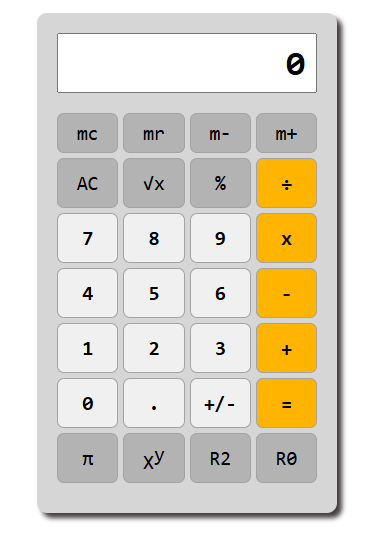

# 🧮 Intermediate-Level Calculator Web App

A **JavaScript-based calculator** built using **HTML, CSS, and JavaScript**.  
It handles both **basic arithmetic** and **extended operations** like power, square root, memory functions, and rounding — ideal for practicing DOM manipulation and logic structuring in JavaScript.

---

## ✨ Features

### 🔹 Core Operations
- Addition (+), Subtraction (−), Multiplication (×), Division (÷), Percentage (%)
- Decimal input and sign toggle (+/−)

### 🔹 Extended Functions
- **Square (x²)** and **Square Root (√x)**
- **Power Function (xʸ)**
- **Pi (π)** constant
- **Rounding Controls:** `R0` and `R2` (round to 0 or 2 decimals)

### 🔹 Memory & Controls
- **Memory Functions:** `MC`, `MR`, `M+`, `M−`
- **Clear Controls:** `AC` (All Clear) and `CE` (Clear Entry)

### 🔹 UI Design
- Simple, single-page layout  
- Smooth hover and active transitions for buttons  
- Subtle visual feedback when interacting  
- **Digit limit handling** to prevent overflow on screen

---

## 💡 Learning Focus
- Practiced **DOM manipulation** and **event-based logic**
- Built **state handling** for memory and operation chaining
- Strengthened understanding of **UI feedback** and **data flow** in JavaScript
- Implemented **digit length control** to manage display overflow and precision

---

## 🛠️ Tech Stack
- **HTML5** – Structure  
- **CSS3** – Styling and transitions  
- **JavaScript (Vanilla)** – Logic and interactivity

---

## 🚀 Future Enhancements
- Add **scientific functions** (sin, cos, log, etc.)  
- Support **parentheses** in expressions  
- Add **keyboard input support**

---

## 📸 Preview

---

